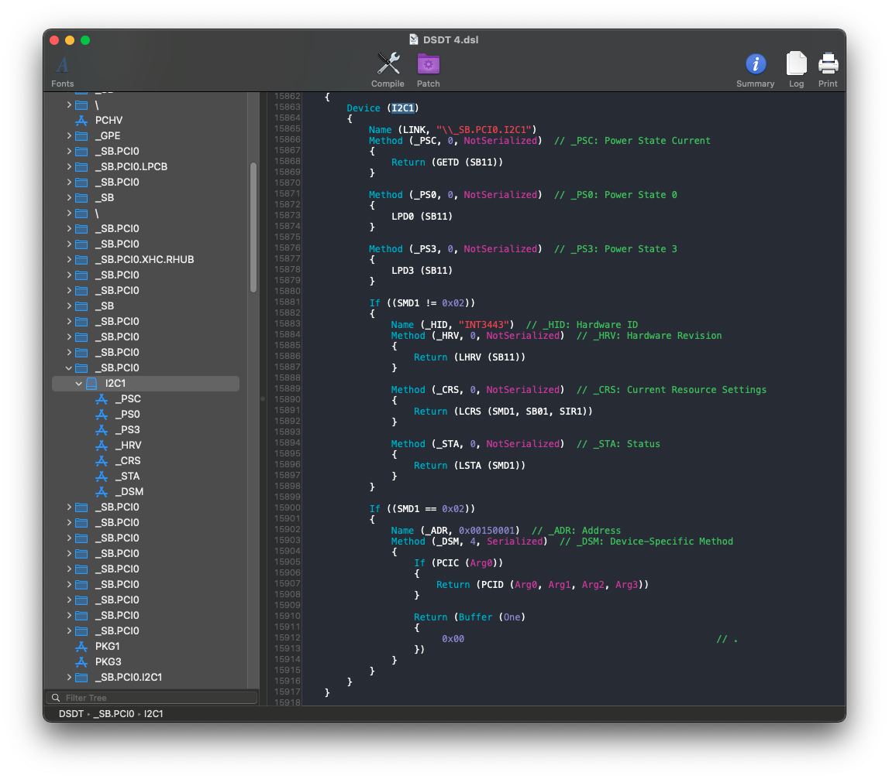
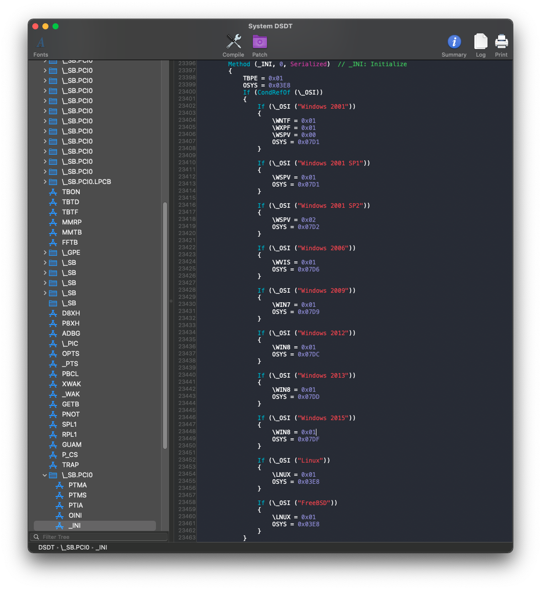

# Fixing Trackpads: Manual

* [Checking GPI0](#checking-gpio)
* [Edits to the sample SSDT](#edits-to-the-sample-ssdt)
* [Enabling Trackpad](#enabling-trackpad)
* [Wrapping up](#wrapping-up)

## Checking GPI0

The first thing which should be checked is the GPI0 device, which is required for VoodooI2C. The best way to check this is working is to use IORegistryExplorer.


Here, we can see that VoodooGPIO is attached to GPI0 so no edits are needed for GPI0. If this is the case for you, you can skip to the [next section](#Enabling-Trackpad).

If VoodooGPIO isn't attached, then you may need to modify the `_STA` method in the `GPI0` device. In that case, you will need to find the GPI0 device in ACPI.

First open your decompiled DSDT you got from [Dumping the DSDT](/Manual/dump.md) and [Decompiling and Compiling](/Manual/compile.md) with either maciASL(if in macOS) or any other text editor if in Windows or Linux (VSCode has an [ACPI extension](https://marketplace.visualstudio.com/items?itemName=Thog.vscode-asl) that can also help).

Next search for `Device (GPI0)`. You should get a result similar to this:


We can see that `_STA` method, which enables or disable the GPI0 device:

```
Method (_STA, 0, NotSerialized)
{
    If ((SBRG == Zero))
    {
        Return (Zero)
    }

    If ((GPEN == Zero))
    {
        Return (Zero)
    }

    Return (0x0F)
}
```

We want the value returned from _STA to be 0x0F to enable the `GPI0` device. If either `SBRG` or `GPEN` is equal to zero, then zero will be returned and `GPI0` will be disabled. Generally, `SBRG` should not be modified, as modifying it can break the `GPI0` device. Only modify `GPEN` if you need to enable the `GPI0` device.

Here's some more examples:


What we care about from this is the `_STA` method:

```
Method (_STA, 0, NotSerialized)
{
    If ((GPHD == One))
    {
        Return (0x03)
    }

    Return (0x0F)
}
```

What we want is for this to always return `0x0F` when booting macOS, so we want to make an SSDT that will return `GPHD == Zero` in macOS.

**NOTE that you may have the other way around where GPHD needs to be set as `One` to return `0x0F`**. And your device name may also be different, don't throw random SSDTs in thinking it'll work

## Edits to the sample SSDT

Now that we have our ACPI path, lets grab our SSDT and get to work:

* [SSDT-GPI0.dsl](https://github.com/dortania/Getting-Started-With-ACPI/blob/master/extra-files/decompiled/SSDT-GPI0.dsl)

From the first example, we'll want to set GPEN to `One` to allow it to operate in macOS:

```
// This is likely already set in the SSDT-GPIO you just downloaded
If (_OSI ("Darwin"))
{
    GPEN = One
}
```

For the second example, you'd want to remove GPEN and use the below:
```
If (_OSI ("Darwin"))
{
    GPHD = Zero
}
```

You will want to test the SSDT at this point by [compiling the SSDT](/Manual/compile.md) and adding it to your config.plist. VoodooGPIO should now be attached to the GPI0 device as shown at the top of the GPI0 section. If your trackpad still doesn't work after enabling the `GPI0` device, move on to the next section.

## Enabling Trackpad

Often times, the I2C devices check to see if they are running in Windows before enabling themselves. Similarly to the `GPI0` device, these devices contain a `_STA` method. For example, this is the I2C1 device below:



The part we care about is the `_STA` method:

```
Method (_STA, 0, NotSerialized)  // _STA: Status
{
    Return (LSTA (SMD1))
}
```

In this case, `_STA` is referring to another method, `LSTA`. If we search for `Method (LSTA`, we'll see the below:

```
Method (LSTA, 1, Serialized)
{
    If (((Arg0 == 0x00) || (Arg0 == 0x03)))
    {
        Return (0x00)
    }

    If (CondRefOf (OSYS))
    {
        If ((OSYS < 0x07DC))
        {
            Return (0x00)
        }
    }

    Return (0x0F)
}
```

`LSTA` checks `Arg0` and `OSYS`. `Arg0` is the value passed in from where it's called. In this example, `_STA` passes in `SMD1` as Arg0. This value should already be correct. The value which we should check is `OSYS`, which is a value which stores information about the current OS running. We will want to look for any place in which `OSYS` is set (`OSYS = 0x07DC` for example). In this DSDT, this is set under `\_SB.PCI0._INI` as shown below:



There are various checks for many different versions of Windows, but there is no check for `Darwin` (which Apple's ACPI usually checks for). We generally want to set `OSYS` to the value for the latest version of Windows in order to enable the most features. In this case, the latest version of Windows is "Windows 2015", or [Windows 10](https://docs.microsoft.com/en-us/windows-hardware/drivers/acpi/winacpi-osi#_osi-strings-for-windows-operating-systems). This means that we should set OSYS to `0x07DF`. Notice that this value is greater than the `OSYS < 0x07DC` value being checked for earlier, which means that the check in LSTA should return `0x0F` now.

The best way to patch these checks is to use _OSI to XOSI with SSDT-XOSI, or to set the OSYS value just within the scope of the I2CX device. Attempting to set OSYS directly generally fails as _INI sets a default value which will override whatever value you set.

### _OSI to XOSI

Requires the below SSDT and patch

* [SSDT-XOSI.dsl](/extra-files/decompiled/SSDT-XOSI.dsl) - If you need to edit the supported OSes
* [SSDT-XOSI.aml](/extra-files/compiled/SSDT-XOSI.aml) - Precompiled
* XOSI Rename(add this under config.plist -> ACPI -> Patch):

| Comment | String | Change _OSI to XOSI |
| :------ | :------ | :------- |
| Enabled | Boolean | YES      |
| Count   | Number  | 0        |
| Limit   | Number  | 0        |
| Find    | Data    | 5f4f5349 |
| Replace | Data    | 584f5349 |

### Create OSYS Variable Under I2C Scope

You will need to find the device path of your I2C device, and add to your SSDT. You will need to add this in whichever scope checks for OSYS, though won't work if you add this under \_SB.PCI0 since this is generally the same scope in which the _INI method will set depending on the running OS.

```
If (_OSI("Darwin")) {
    Scope (\_SB.PCI0.I2C0) { // I2C0 scope
        Name (OSYS, 0x7DF)
    }
}
```

### Note:
Windows will also return true for checks of earlier versions of the OS. For example, Windows 7 would return true for "Windows 2000" through "Windows 2009", but not any version after. This is important as some features are only enabled in earlier Windows checks. For example, `WNTF = 0x01` allows DYTC thermal management to work on newer Thinkpads, though this only gets set in the check for "Windows 2001". You will need to check your own DSDT and see what values it sets and where they are used. At this point, you should [compile your SSDT]([compiling the SSDT](/Manual/compile.md)) and see if the trackpad works.

## Further Setup

If you need further help getting your trackpad to work, then the best place to look is [VoodooI2C's readme](https://github.com/VoodooI2C/VoodooI2C)

## Wrapping up

Once you're done making your SSDT, either head to the next page to finish the rest of the SSDTs or head here if you're ready to wrap up:

* [**Cleanup**](/cleanup.md)
